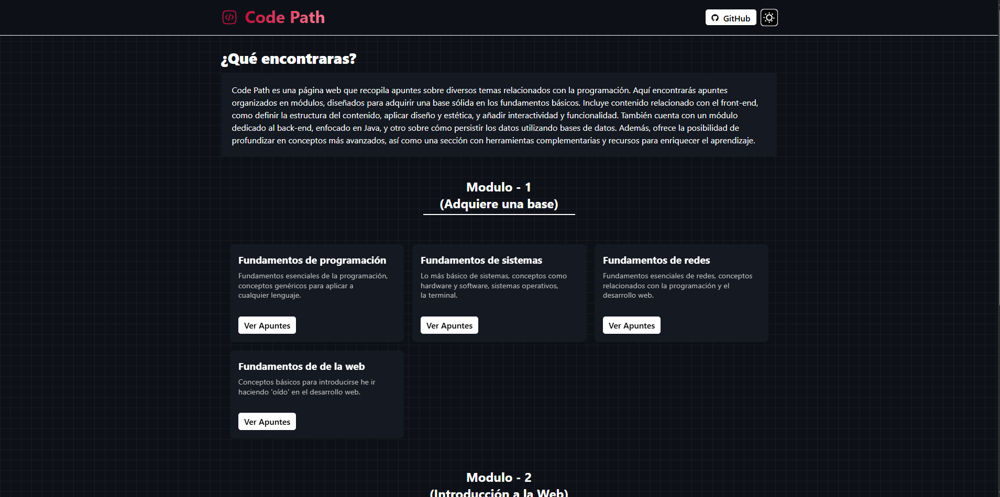
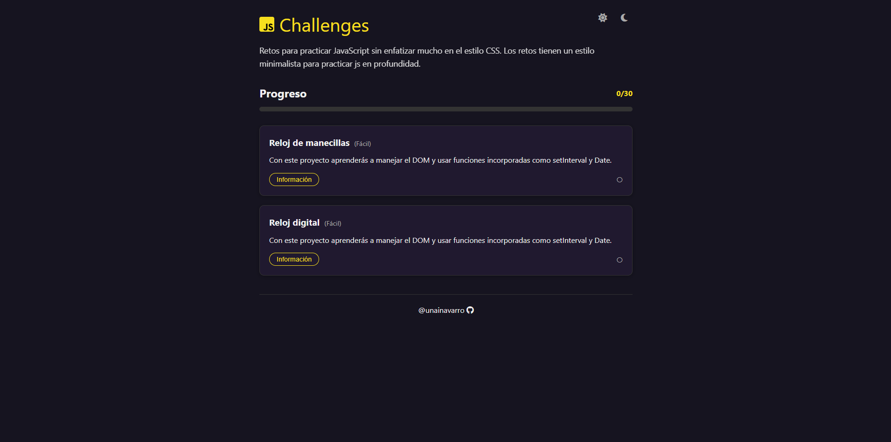
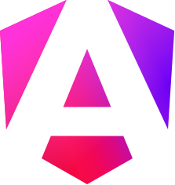

<hr>
<br>


<div  style="min-width:650px; max-width:650px;">

```bash
    > Unai Navarro:

        🌐 : unainavarro@github.com
    ┌──────────────────────────────────────────┐
      🧑‍💻 : Software developer
      ✨ : Java - Angular - SQL
      🔭 : Nuevos proyectos
      📫 : unai_navarro@outlook.com
    └──────────────────────────────────────────┘
```

</div>

---

<div align="center">
<details markdown='1'> 
<summary style="font-size:1.8rem">Ver más 👀</summary>

<div align="left">

## Sobre mí

Comencé en el mundo de la informática estudiando un grado en Administración de Sistemas en Red. Entre todos los temas que se abordaban, descubrí que la programación era lo que más me apasionaba. Esto me llevó a continuar mi formación con un grado en Desarrollo de Aplicaciones Web (DAW).

Al finalizar mis estudios, en plena pandemia, tuve la suerte de encontrar trabajo, aunque no estuvo relacionado con lo que había estudiado. Aun así, nunca dejé de lado la programación.

Actualmente, sigo formándome por mi cuenta y estoy en búsqueda activa de una oportunidad profesional dentro del sector tecnológico. Mi objetivo es seguir creciendo como desarrollador y aportar valor con lo que sé... y con todo lo que aún me queda por aprender.

<!-- ## Estadísticas

<table>
  <tr>
    <td>
      
    </td>
    <td>
      &nbsp;
    </td>
    <td>
      
    </td>
  </tr>
</table> -->

<!--  -->
<!--  -->

## Proyectos

<table style="width:100%">
<tr>
<td>
<a title="Code-Path" href="https://code-path.netlify.app/" target="_blank">

</a>
</td>
<td>
<a title="Front-Hub" href="https://front-hub.netlify.app/" target="_blank">

</a>
</td>
<td>
<a title="JS-Challenges" href="https://js-challenges-u.netlify.app/" target="_blank">

</a>
</td>
</tr>
</table>

## Tecnologías

<table style="width:100%;" >
<tr>
<td style="border-right: 2px solid gray;">
<h3>Back-End</h3>


</td>

<td style="border-right: 2px solid gray;">
<h3>Front-End</h3>



</td>

<td>
<h3>Tools</h3>


</td>

</tr>
</table>

<div align="center">
 
</div>

</div>

---

</details>

---

<p align="center">
  
</p>
