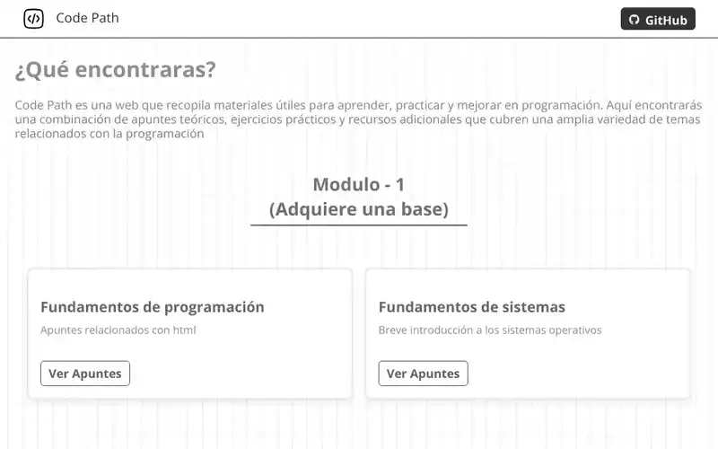

<hr>
<br>


<div  style="min-width:650px; max-width:650px;">

```bash
    > Unai Navarro:

        🌐 : unainavarro@github.com
    ┌──────────────────────────────────────────┐
      🧑‍💻 : Software developer
      ✨ : Java - React - SQL
      🔭 : Nuevos proyectos
      📫 : unai_navarro@outlook.com
    └──────────────────────────────────────────┘
```

</div>

---

<div align="center">
<details markdown='1'> 
<summary style="font-size:1.8rem">Ver más 👀</summary>

<div align="left">
         
## Estadísticas

<table>
  <tr>
    <td>
      
    </td>
    <td>
      &nbsp;
    </td>
    <td>
      
    </td>
  </tr>
</table>

<!--  -->
<!--  -->

## Proyectos

<table style="width:100%">
<tr>
<td>
<a href="https://code-path.netlify.app/">

</a>
</td>
</tr>
</table>

## Tecnologías

<table style="width:100%;" >
<tr>
<td style="border-right: 2px solid gray;">
<h3>Back-End</h3>


</td>

<td style="border-right: 2px solid gray;">
<h3>Front-End</h3>


</td>

<td>
<h3>Tools</h3>


</td>

</tr>
</table>

<div align="center">
 
</div>

</div>

---

</details>

---

<p align="center">
  
</p>
